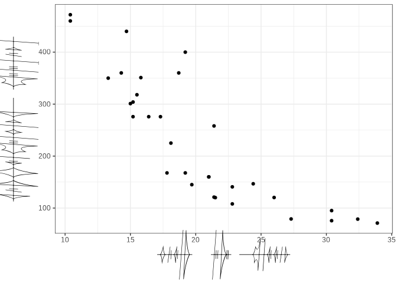

<!-- README.md is generated from README.Rmd. Please edit that file -->

# Alethi font in ggplot2

This repository contains:

- the Alethi font, as created by turos of tempered steel (obtained from
  <https://www.17thshard.com/forum/topic/2285-alethi-font-and-transliterator-re-launch/>).
- the code examples for the usege of the Alethi font in ggplot2
  (**figure.R**).

``` r
library(ggplot2)
library(showtext)
#> Loading required package: sysfonts
#> Loading required package: showtextdb

font_add(family = "AlethiTS_lined", regular = "AlethiTS Fontv2/AlethiTS_lined.ttf")

showtext_auto()

ggplot(mtcars, aes(x = mpg, y = disp)) +
  geom_point() +
  scale_x_continuous("Miles/(US) gallon") +
  scale_y_continuous("Displacement (cu.in.)") +
  theme_bw() +
  theme(legend.position = "bottom",
        axis.title = element_text(family = "AlethiTS_lined"))
```

<!-- -->

*Journey before destination*.
